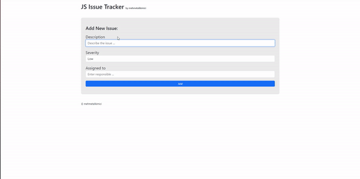

# Issue Tracker

I created an issue tracker site. In the design, I implemented the dynamics with JavaScript along with CSS and Bootstrap. 

As seen in the design, I created a issue tracker where we can add topics according to their priorities and for different people.
After the issues were added, I created the dynamics with JavaScript and added closing and deleting the topics after they were completed to my project.

<h2>Used Tech.</h2> 
<ul>
  <li>HTML was used.</li>
  <li>CSS was used in design.</li>
  <li>Bootstrap was used in design.</li>
  <li>Javascript was used in dynamics.</li>
</ul>
<h2>Screen</h2>

